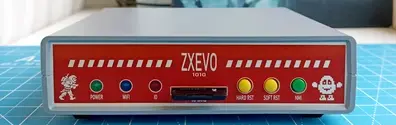
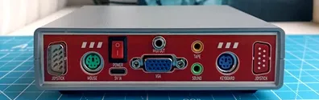
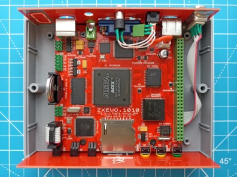
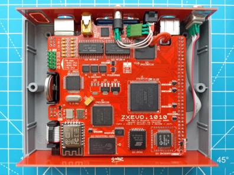
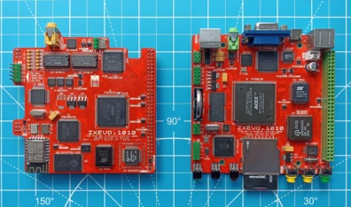
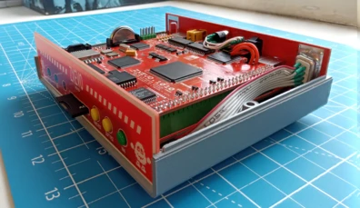

## ZX-EVO.1010
10x10cm PCB variant of ZX-Evolution project

Tech specs:
- Fully compatible with ZX Evolution revC
- SD/microSD card slot
- PS/2 keyboard and mouse ports
- VGA video output
- VDAC2
- TSFM
- NeoGS
- SounDrive
- MIDI onboard synthesizer and output for external synthesizer
- WiFi (ZiFi)
- RTC
- Tape input via 3.5 jack
- 1xDB-9 port for Sega-compatible joysticks
- USB Type C power supply
- Board optimized for G738 and G706 cases

### Changelog
#### Main PCB
* Rev.A - first release
* Rev.A1:
    * enlarged ACEX's footprint
    * fixed IO led always on in baseconf - added C92 and D7
    * changed R66 from 390Ω to 2.2kΩ to reduce power led bightness
    * changed R52 and R58 from 27kΩ to 18kΩ for better VDAC2 mixing volume
    * slightly moved U18
    * some minor changes

#### Top PCB
* Rev.A - first release
* Rev.A1:
    * added 51Ω R1 and R3 on DAC and MP3 clock signals to fix signal integrity issues
    * changed U9 from SN74LXC8T245PWR (which is unsuitable) to 74LVC245APW
    * changed R7 from 120Ω to 1kΩ to decrease LED brightness
    * changed R26 and R29 from 8.2kΩ to 18kΩ for better NeoGS mixing volume
    * changed R23 and R31 from 22kΩ to 15kΩ for better MIDI mixing volume
    * changed R65, R66, R67 and R68 from 8.2kΩ to 3.3kΩ for better PSG mixing volume (but this makes FM a unbalancy loud unfortunatelly)
    * added R50, R51, R61, C102, C103, C104 for VS10xx MP3 decoder
    * fixed swapped left-right sound channels
    * increased cutoff for CR2032 holder

### Useful software
* NedoOS (BaseConf): http://nedoos.ru/
* Wild Commander (TSConf): https://forum.tslabs.info/viewtopic.php?f=26&t=143
* ZiFi WiFi client TSConf: http://zifi.vtrd.in/
* TSConf software library: https://prods.tslabs.info/
* Joystick configuration utility (TSConf): https://github.com/tslabs/zx-evo/tree/master/pentevo/soft/avrconf

### References
* ZX Evolution official site: http://nedopc.com/zxevo/zxevo.php
